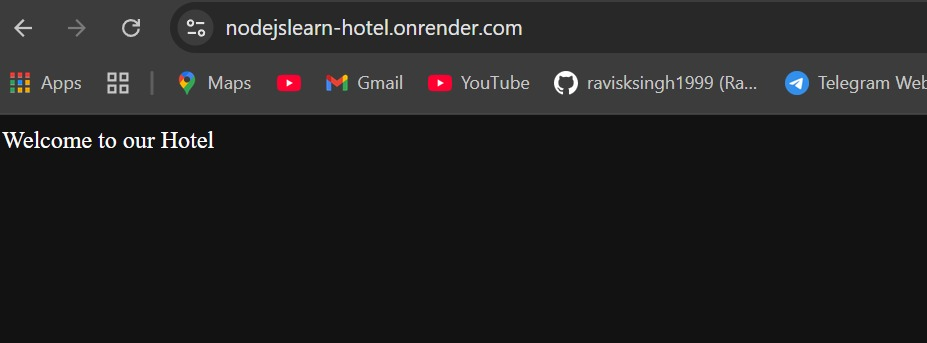
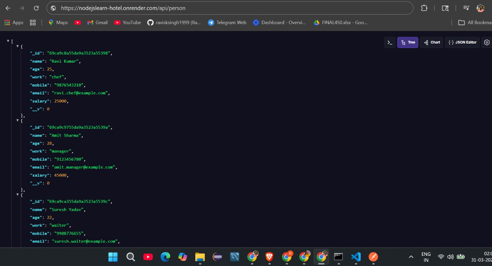
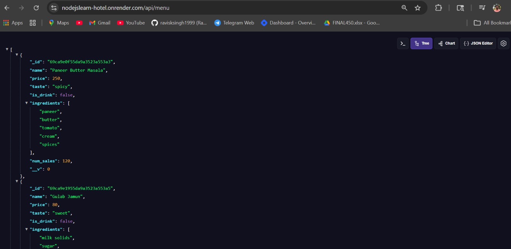
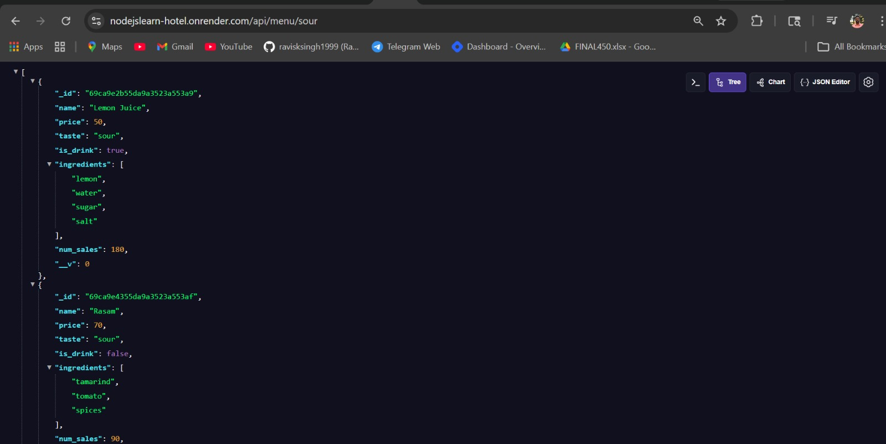

# NodeJsLearn-Hotel

A complete Node.js backend project for a hotel management system.

## Features

- User roles (chef, waiter, manager)
- Menu management
- MongoDB integration

## Tech Stack

- Node.js
- Express.js
- MongoDB

## How to Run

npm install
nodemon server.js

## 📸 Screenshots

